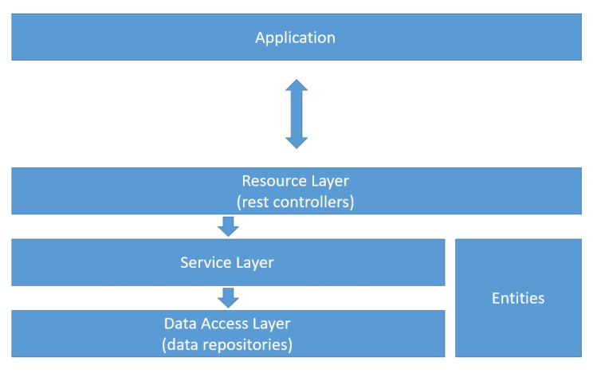
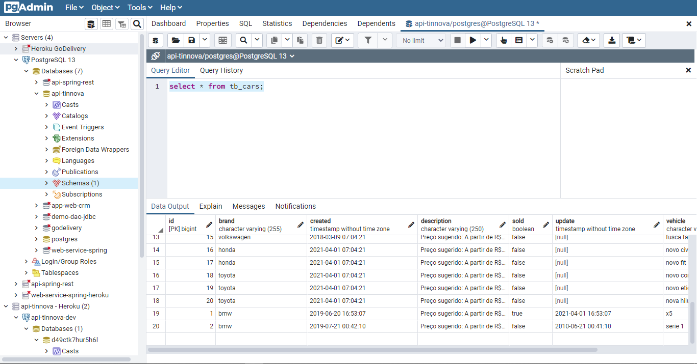
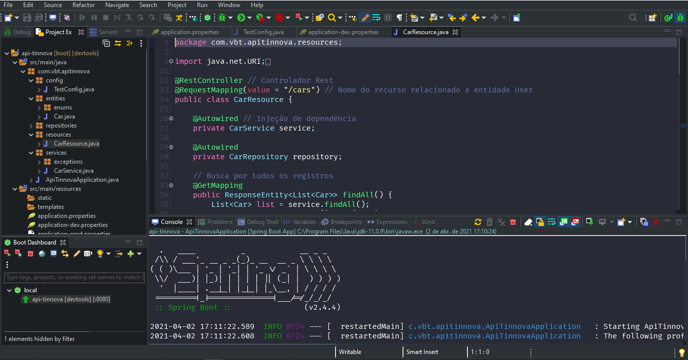
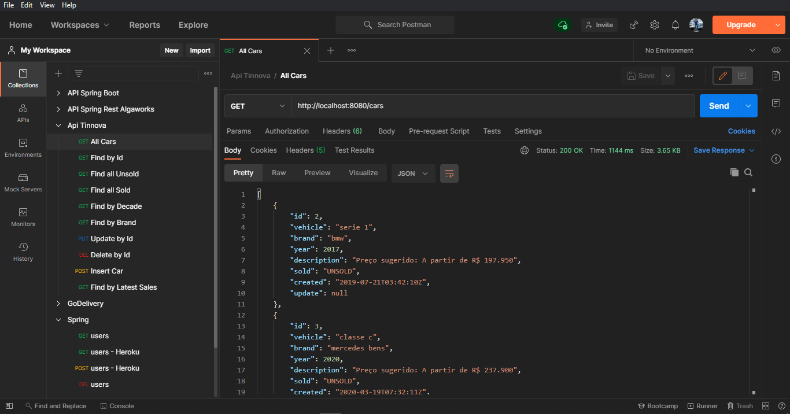

<h1 align="center">
     API RESTful Tinnova - Web Service Project 1.0 
    Spring Boot | Java | PostgreSQL | Heroku
</h1>

    
    
    

    <a href="#bookmark-About-this-project">About</a>&nbsp;&nbsp;&nbsp;|&nbsp;&nbsp;&nbsp;
    <a href="#rocket-Technologies-used">Technology</a>&nbsp;&nbsp;&nbsp;|&nbsp;&nbsp;&nbsp;
    <a href="#boom-How-to-run">How to run</a>&nbsp;&nbsp;&nbsp;|&nbsp;&nbsp;&nbsp;
    <a href="#memo-License">License</a>

## :bookmark: About this project

A **API Tinnova** é um projeto Web Service para cadastro de veículos. Utilizando Spring Boot, JPA / Hibernate gerenciados pelo Maven, utilizando técnicas DevOps para implantação em nuvem usando a plataforma Heroku.

## :rocket: Technologies used

- Java version 11
- Spring Boot version 2.4.2
- Spring Data JPA
- Hibernate (Bean Validation)
- Banco de dados H2 (Para validações de testes)
- Maven Version 4.0.0
- JUnit 5.7.1
- PostgreSQL database Version 13

## :wrench: Tools
- Spring Tool Suite 4
- pgAdmin
- Heroku
- Postman
- Git

<h4 align="left">Backend Structure</h4>
    

<h4 align="left">Database PostgreSQL</h4>
    

<h4 align="left">Spring Tool Suit</h4>
    

<h4 align="left">Checking endpoints with Postman</h4>
    

## :boom: How to run

- ### **Requirements**

  - É **necessário** ter a versão Java 11 instalada e com a variável de ambiente devidamente alocada para operação.
  - É necessário ter a versão Spring Tool Suit 4 para que o projeto funcione corretamente localmente.
  - Para um teste rápido de endpoints, o projeto possui o banco de dados H2 e uma base de desenvolvimento PostgreSQL local, para a qual a versão 13 do PostegreSQL deve ser instalada para funcionar, o script do banco está na pasta do banco de dados. 
  - Para testar os endpoints na base de produção, basta passar a url https://api-tinnova-dev.herokuapp.com/ com os devidos endpoits configurados.
  
- ### **Testing**

  Conforme demostrado em **Backend Structure**, a API é dividida em três camadas: Repository / Service / Resource(Controller), aonde a camada Resouce contém todos os endpoints implementados, pois se trata da camada controladora.

  São estes os endpoits responsáveis pelas requisições realizadas na aplicação:

    *GET*
  - **All Cars:** https://api-tinnova-dev.herokuapp.com/cars (Busca por todos os registros)
  - **Find by Id:** https://api-tinnova-dev.herokuapp.com/cars/2 (Busca registros por Id)
  - **Find all Unsold:** https://api-tinnova-dev.herokuapp.com/cars/unsold (Busca somente veículos não vendidos)
  - **Find all Sold:** https://api-tinnova-dev.herokuapp.com/cars/sold (Busca somente veículos vendidos)
  - **Find by Decade:** https://api-tinnova-dev.herokuapp.com/cars/decade/1980 (Busca distribuições de veículos por década de fabricação)
  - **Find by Brand:** https://api-tinnova-dev.herokuapp.com/cars/brand/bmw (Busca distribuições de veículos por fabricante)
  
  *POST*
  - **Insert Car:** https://api-tinnova-dev.herokuapp.com/cars (Insere novo registro)
  
  *PUT*
  - **Update by Id:** https://api-tinnova-dev.herokuapp.com/cars/2 (Atualiza registro por Id)
  
  *DEL*
  - **Delete by Id:** https://api-tinnova-dev.herokuapp.com/cars/14 (Deleta registro por Id)

    Modelo de requisição JSON retornada:
      {
        "id": 2,
        "vehicle": "serie 1",
        "brand": "bmw",
        "year": 2017,
        "description": "Preço sugerido: A partir de R$ 198.950",
        "sold": "UNSOLD",
        "created": "2019-07-21T03:42:10Z",
        "update": "2010-06-21T03:41:10Z"
      }

## :memo: License

Este projeto está sob a licença do MIT.
